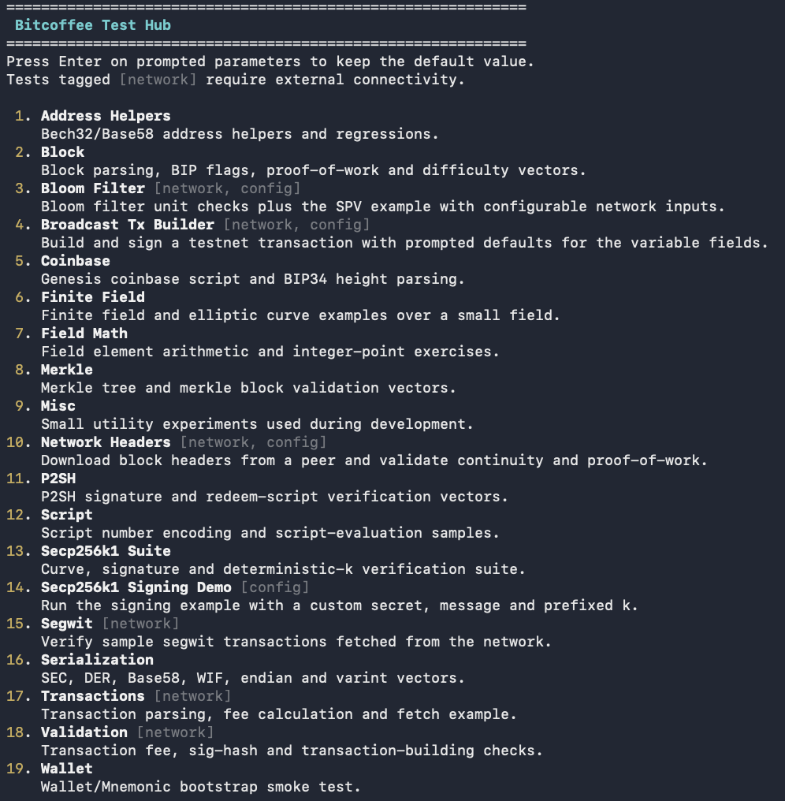

# bitcoffee

`bitcoffee` is a from-scratch, zero-dependency Java implementation of several Bitcoin internals, inspired by Jimmy Song's [Programming Bitcoin](https://programmingbitcoin.com/).

This project was built for fun, learning, and research. It is not production software, and it should not be used to move real funds on mainnet.

## Highlights

- Finite field math, elliptic curve arithmetic, secp256k1, ECDSA, SEC, DER, SHA-256, RIPEMD160, Base58, Bech32, endian/hex helpers, and varint encoding
- Transaction parsing and serialization
- Bitcoin Script parsing and execution
- Proof-of-work and difficulty adjustment
- Block/header download and validation against external peers
- SPV, Merkle trees, and Bloom filters
- Segregated Witness: `p2wpkh`, `p2sh-p2wpkh`, `p2wsh`, `p2sh-p2wsh`
- Hierarchical deterministic wallets with BIP39 mnemonic seed phrase support
- Command line tools, a small GUI, and an interactive terminal test hub

## Test Hub

The repository now includes a terminal text-based test launcher that works on standard Linux and macOS terminals.

- Select a single test from a menu instead of changing the launched class every time
- For configurable tests, press Enter to keep sensible defaults or override only the parameters you care about
- Network-dependent tests are clearly marked in the menu
- ANSI colors are used when supported and automatically fall back to plain text on simpler terminals



### Quick start

From a fresh checkout, run:

```sh
./run-test-hub.sh
```

The script:

- checks that `javac` and `java` are available
- compiles the sources into `out/testhub`
- launches `Tests.TestHub`

If you want plain output without ANSI colors:

```sh
NO_COLOR=1 ./run-test-hub.sh
```

## Other ways to run bitcoffee

- Command line: [src/bitcoffee.java](src/bitcoffee.java) exposes a small CLI for some library functions
- GUI: [src/GUI/Dashboard.java](src/GUI/Dashboard.java) provides a simple desktop interface for selected features
- Direct test execution: each class in `src/Tests` still has its own `main` method, so you can run a single test directly from the IDE or with `java`

Example manual launch without the helper script:

```sh
javac -d out/testhub $(find src -name '*.java' | sort)
java -cp out/testhub Tests.TestHub
```

## Notes

- Some tests require network access and reachable peers
- The broadcast transaction flow expects real testnet-specific inputs before it can build a valid transaction
- The code in `src/Tests` is still a useful reference if you want to see how a specific feature is invoked programmatically

Feel free to suggest improvements at `xedivad@gmail.com`.

Support the Lightning Network, connect to node:

`03740f82191202480ace717fcdf00f71a8b1eb9bdc2bb5e2106cd0ab5cb4d7a54e`
